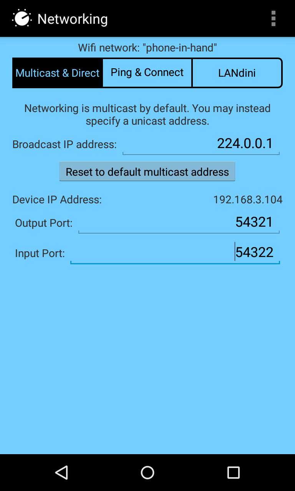

## Message Choir 사용 매뉴얼

[>> English-version](index-eng.md)

---

### 소개

공유기를 이용한 LAN 네트워크 환경에서, 다수의 (스)맛폰의 연동된 피아노 건반을 제공하는 앱.

Mobmuplat + Pure data + LANdini 를 이용하는 환경에서 개발됨 / 스마트폰에 설치하여 사용.

하나된 우리의 목소리.

---

### 설치 단계 (1) - MobMuplat 설치

---

**단계 2 진행전 설치 완료 필수!**

---

### 설치 단계 (2) - 따라하기, 말로만~

1. 클릭하여 다운로드 <http://msgchoir.github.io/msgchoir.zip>
2. 다운로드 된거 (msgchoir.zip), 클릭하여 열기. 이때, MubMuPlat으로 열기를 선택!
3. 압축 풀려서 잘 설치되었다는 메세지 확인.
4. 좌측 상단의 i 모양 아이콘 클릭
5. 메뉴버튼(기기마다 표시형태가 다름)을 누르고, Network항목 클릭. LANdini 탭을 선택하고 스위치를 켬.
6. 메뉴버튼 누르고, Documents항목 클릭, 나타난 목록 중, messagechoir.mmp란 파일을 클릭
7. 총 4개의 페이지로 구성되어 있으며, 페이지는 swipe (화면을 좌우로 쓸듯이 터치+드래그)하여 이동.
8. 첫페이지에서 tone을 청취
9. 다음 페이지에서 목소리로 녹음. 이때, 해당 건반을 3초 이상 누르면, 녹음이 시작됨
10. 3초 이전에 손을 떼면, 녹음된 소리를 들어서 확인할 수 있음
11. 다음 페이지에서 네트워크의 녹음 상황 조회. 'network refresh!' 버튼을 누름. 위엣줄은 네트워크전체의 녹음현황이고 아랫줄은 내 폰에서 해당 음에 참여할 것인지 여부.
12. clap을 누르면, 네트워크 전체에 박수소리가 전파되어, 연결 상태를 테스트할 수 있음
13. 다음 페이지에서 연주함. 이때, 해당 노트에 참여하는 (스)맛폰에서는 일제히 소리를 내게 됨
14. 한 사람이 연주하면, 모두가 한 목소리로 노래함. 여럿이 연주하면? 난리부르스.

---

### 설치 단계 (2) - 따라하기, 그림만, @.@!

---

### 참고 내용

- 연락처 및 정보 : <http://dianaband.info>

- Git repository : <https://github.com/msgchoir/msgchoir.github.io>

